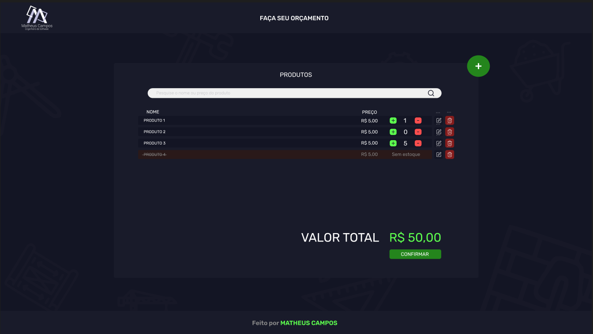

# 🏗️ Calculadora de Orçamentos para Lojas de Material de Construção  

  

Este projeto é uma aplicação para ajudar lojas de material de construção a gerenciar produtos e calcular orçamentos de forma eficiente. Com uma interface amigável e conectada a um backend robusto, a aplicação permite:  

- **Gerenciar produtos:** adicionar, editar, deletar e pesquisar itens no sistema.  
- **Calcular orçamentos:** calcular automaticamente o valor total dos materiais incluídos.  

---

## 🚀 Funcionalidades  

### 🔨 Gerenciamento de Produtos  
- **Adicionar Produto:** Insira novos produtos com nome, preço, descrição e outros detalhes.  
- **Editar Produto:** Atualize informações de produtos existentes.  
- **Deletar Produto:** Remova itens descontinuados.  
- **Pesquisar Produto:** Localize produtos rapidamente por nome ou outros critérios.  

### 📋 Cálculo de Orçamentos  
- Monte orçamentos personalizados com os produtos cadastrados.  
- Calcule o valor total dos materiais automaticamente.  

---

## 🛠️ Tecnologias Utilizadas  

### Frontend  
- **Angular 17**: Framework moderno para criar aplicações web.  
- **SCSS**: Estilização avançada com suporte a variáveis e mixins.  
- **Angular Material**: Biblioteca de componentes para uma interface consistente e responsiva.  

### Backend  
- **Spring Boot**: API REST robusta e escalável.  
- **PostgreSQL**: Banco de dados relacional para armazenar informações de produtos e orçamentos.  

---

## ⚙️ Instalação e Uso  

### Pré-requisitos  
Certifique-se de ter as seguintes ferramentas instaladas:  
- **Node.js** e **npm** ou **yarn** (para o frontend).  
- **Java 17** e **Maven** (para o backend).  
- **PostgreSQL** (para o banco de dados).  

### Passos para rodar o projeto  

#### 1. Clone o repositório:  
```bash
git clone https://github.com/seu-usuario/seu-repositorio.git
cd seu-repositorio
